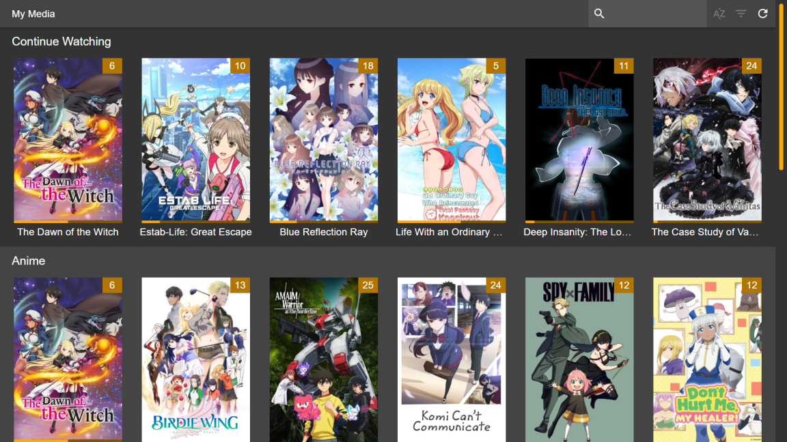
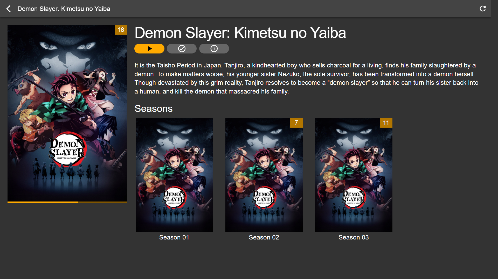
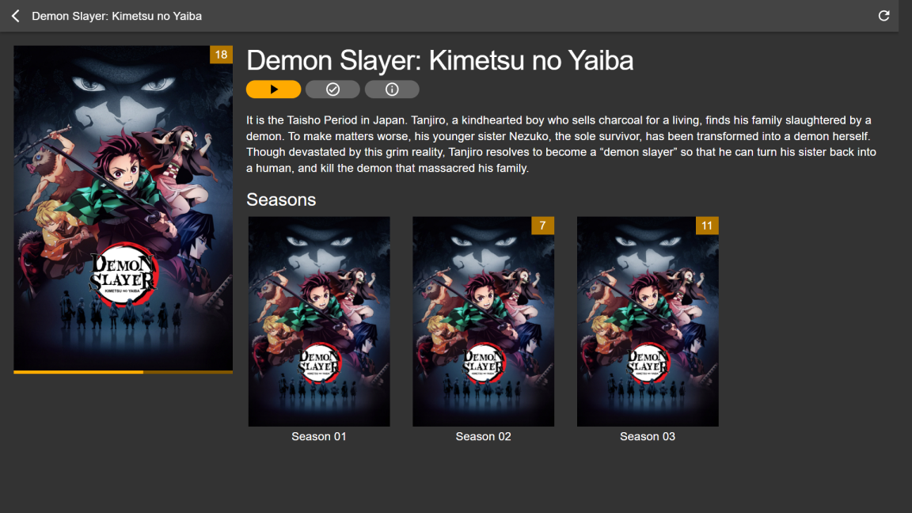
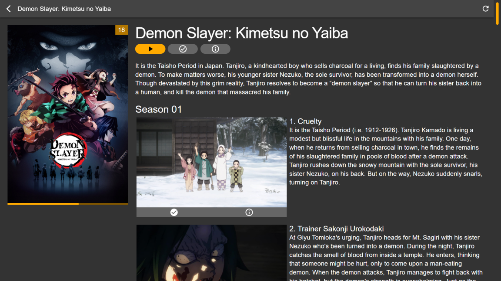

# Ulmas

Ulmas is a *media solution*, akin to the likes of *Emby*, *Jellyfin*, *Kodi* or *Plex*, with one major difference: this application focuses *exclusively* on your media interface. It's the missing component that positions itself between your already existing *metadata*, and your already installed *mpv* media player. Your content, your rules. **Currently in development.**

* **Ulmas is not a metadata manager:** You will need to prepare *Kodi*-compatible *metadata* yourself. Ulmas scans your metadata files and saves your watch progress in them. Ulmas cannot download *metadata*, and it never will. Recommended applications to manage metadata include [*Radarr*](https://github.com/Radarr/Radarr), [*Sonarr*](https://github.com/Sonarr/Sonarr) and [*TinyMediaManager*](https://gitlab.com/tinyMediaManager/tinyMediaManager).

* **Ulmas is not a media player:** You will need to install [*mpv*](https://github.com/mpv-player/mpv) media player yourself. Ulmas launches your *mpv* media player and tracks your watch progress through a programmatic interface. This ensures that you have full control over your watch experience, and Ulmas doesn't have to pretend to be a *somewhat decent* media player.

* **Ulmas is not ambitious:** If you need an advanced feature from an application such as *Jellyfin* or *Kodi*, you're best served sticking to them. Ulmas serves a *niche*. It aims to provide a amazing user interface and a slick user experience for those who *demand* control over their *metadata*, and *insist* on having the best watch experience.

## Preview

<table width="100%">
  <tr>
    <td width="50%"></td>
    <td width="50%"></td>
  </tr>
  <tr>
    <td width="50%"></td>
    <td width="50%"></td>
  </tr>
</table>

## Installation

### Linux

1. [Download the latest Linux image](https://github.com/Deathspike/ulmas/releases/latest).
2. Make the Ulmas *AppImage* executable.
3. Run Ulmas. Enjoy!

### macOS

1. [Download the latest Mac installer](https://github.com/Deathspike/ulmas/releases/latest).
2. Run the installer. Drag Ulmas to *Applications*.
3. Run Ulmas. *Mac* will block the application. Click on *Cancel*.
4. Open *Security & Privacy*. Click on the *Lock* icon to make changes.
5. Click on the *Allow* button next to the message about Ulmas.
6. Run Ulmas. Enjoy!

### Windows

1. [Download the latest Windows installer](https://github.com/Deathspike/ulmas/releases/latest).
2. Run the installer. *Windows* will block the installation.
3. Click on *More Info* and then click on *Run anyway*.
4. Enjoy Ulmas!

## Troubleshooting

Press `F12` to open the console and access the *logs*.

## Developers

The *REST API* to interface with Ulmas is available at http://127.0.0.1:6877/api/.

### Metadata

All metadata is expected to be *Kodi*-compatible.

#### Movies

Based on https://kodi.wiki/view/NFO_files/Movies.

| API Field  | NFO Field  | Required | Patchable | Notes                         |
|------------|------------|----------|-----------|-------------------------------|
| id         | -          | -        | -         | Hash of path to `.nfo` file   |
| path       | -          | -        | -         | Path to `.nfo` file           |
| media      | -          | -        | -         | Matched media for `movie`     |
| title      | title      | Yes      | No        |                               |
| dateAdded  | dateadded  | No       | No        | Uses `btime` if not in `.nfo` |
| lastPlayed | lastplayed | No       | Yes       |                               |
| playCount  | playcount  | No       | Yes       |                               |
| plot       | plot       | No       | No        |                               |
| resume     | resume     | No       | Yes       |                               |
| watched    | watched    | No       | Yes       | Must be `true` or `false`     |

#### Series

Based on https://kodi.wiki/view/NFO_files/TV_shows.

| API Field        | NFO Field  | Required | Patchable | Notes                              |
|------------------|------------|----------|-----------|------------------------------------|
| id               | -          | -        | -         | Hash of path to `.nfo` file        |
| path             | -          | -        | -         | Path to `.nfo` file                |
| images           | -          | -        | -         | Matched images for `tvshow`        |
| episodes         | -          | -        | -         | Array of `Episode`                 |
| dateEpisodeAdded | -          | -        | -         | Derived from `episodes.dateAdded`  |
| totalCount       | -          | -        | -         | Derived from `episodes`            |
| unwatchedCount   | -          | -        | -         | Derived from `episodes.watched`    |
| title            | title      | Yes      | No        |                                    |
| dateAdded        | dateadded  | No       | No        | Uses `btime` if not in `.nfo`      |
| lastPlayed       | lastplayed | No       | Yes       |                                    |
| plot             | plot       | No       | No        |                                    |

#### Episode

Based on https://kodi.wiki/view/NFO_files/Episodes.

| API Field  | NFO Field  | Required | Patchable | Notes                         |
|------------|------------|----------|-----------|-------------------------------|
| id         | -          | -        | -         | Hash of path to `.nfo` file   |
| path       | -          | -        | -         | Path to `.nfo` file           |
| media      | -          | -        | -         | Matched media for `episode`   |
| episode    | episode    | Yes      | No        |                               |
| season     | season     | Yes      | No        |                               |
| title      | title      | Yes      | No        |                               |
| dateAdded  | dateadded  | No       | No        | Uses `btime` if not in `.nfo` |
| lastPlayed | lastplayed | No       | Yes       |                               |
| playCount  | playcount  | No       | Yes       |                               |
| plot       | plot       | No       | No        |                               |
| resume     | resume     | No       | Yes       |                               |
| watched    | watched    | No       | Yes       | Must be `true` or `false`     |
