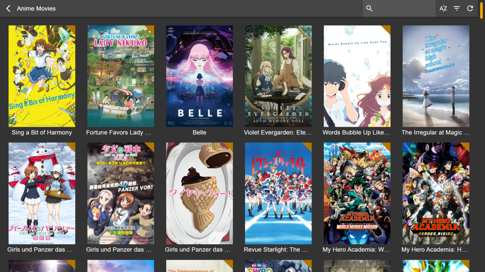

# Ulmas

Ulmas is a _media solution_, akin to the likes of _Emby_, _Jellyfin_, _Kodi_ or _Plex_, with one major difference: this application focuses _exclusively_ on your media interface. It's the missing component that positions itself between your already existing _metadata_, and your already installed _mpv_ media player. Your content, your rules. **Currently in development.**

- **Ulmas is not a metadata manager:** You will need to prepare _Kodi_-compatible _metadata_ yourself. Ulmas scans your metadata files and saves your watch progress in them. Ulmas cannot download _metadata_, and it never will. Recommended applications to manage metadata include [_Radarr_](https://github.com/Radarr/Radarr), [_Sonarr_](https://github.com/Sonarr/Sonarr) and [_TinyMediaManager_](https://gitlab.com/tinyMediaManager/tinyMediaManager).

- **Ulmas is not a media player:** You will need to install [_mpv_](https://github.com/mpv-player/mpv) media player yourself. Ulmas launches your _mpv_ media player and tracks your watch progress through a programmatic interface. This ensures that you have full control over your watch experience, and Ulmas doesn't have to pretend to be a _somewhat decent_ media player.

- **Ulmas is not ambitious:** If you need an advanced feature from an application such as _Jellyfin_ or _Kodi_, you're best served sticking to them. Ulmas serves a _niche_. It aims to provide an amazing user interface and a slick user experience for those who _demand_ control over their _metadata_, and _insist_ on having the best watch experience.

## Preview

<table width="100%">
  <tr>
    <td width="50%"></td>
    <td width="50%"></td>
  </tr>
  <tr>
    <td width="50%"></td>
    <td width="50%"></td>
  </tr>
</table>

## Installation

### Linux

1. [Download the latest Linux image](https://github.com/Deathspike/ulmas/releases/latest).
2. Make the Ulmas _AppImage_ executable.
3. Run Ulmas. Enjoy!

### macOS

1. [Download the latest Mac installer](https://github.com/Deathspike/ulmas/releases/latest).
2. Run the installer. Drag Ulmas to _Applications_.
3. Run Ulmas. _Mac_ will block the application. Click on _Cancel_.
4. Open _Security & Privacy_. Click on the _Lock_ icon to make changes.
5. Click on the _Allow_ button next to the message about Ulmas.
6. Run Ulmas. Enjoy!

### Windows

1. [Download the latest Windows installer](https://github.com/Deathspike/ulmas/releases/latest).
2. Run the installer. _Windows_ will block the installation.
3. Click on _More Info_ and then click on _Run anyway_.
4. Enjoy Ulmas!

## Troubleshooting

Press `F12` to open the console and access the _logs_.

## Developers

The _REST API_ to interface with Ulmas is available at http://127.0.0.1:6877/api/.

### Metadata

All metadata is expected to be _Kodi_-compatible.

#### Movies

Based on https://kodi.wiki/view/NFO_files/Movies.

| API Field  | NFO Field  | Required | Patchable | Notes                         |
| ---------- | ---------- | -------- | --------- | ----------------------------- |
| id         | -          | -        | -         | Hash of path to `.nfo` file   |
| path       | -          | -        | -         | Path to `.nfo` file           |
| media      | -          | -        | -         | Matched media for `movie`     |
| title      | title      | Yes      | No        |                               |
| dateAdded  | dateadded  | No       | No        | Uses `btime` if not in `.nfo` |
| lastPlayed | lastplayed | No       | Yes       |                               |
| playCount  | playcount  | No       | Yes       |                               |
| plot       | plot       | No       | No        |                               |
| resume     | resume     | No       | Yes       |                               |
| watched    | watched    | No       | Yes       | Must be `true` or `false`     |

#### Series

Based on https://kodi.wiki/view/NFO_files/TV_shows.

| API Field        | NFO Field  | Required | Patchable | Notes                             |
| ---------------- | ---------- | -------- | --------- | --------------------------------- |
| id               | -          | -        | -         | Hash of path to `.nfo` file       |
| path             | -          | -        | -         | Path to `.nfo` file               |
| images           | -          | -        | -         | Matched images for `tvshow`       |
| episodes         | -          | -        | -         | Array of `Episode`                |
| dateEpisodeAdded | -          | -        | -         | Derived from `episodes.dateAdded` |
| totalCount       | -          | -        | -         | Derived from `episodes`           |
| unwatchedCount   | -          | -        | -         | Derived from `episodes.watched`   |
| title            | title      | Yes      | No        |                                   |
| dateAdded        | dateadded  | No       | No        | Uses `btime` if not in `.nfo`     |
| lastPlayed       | lastplayed | No       | Yes       |                                   |
| plot             | plot       | No       | No        |                                   |

#### Episode

Based on https://kodi.wiki/view/NFO_files/Episodes.

| API Field  | NFO Field  | Required | Patchable | Notes                         |
| ---------- | ---------- | -------- | --------- | ----------------------------- |
| id         | -          | -        | -         | Hash of path to `.nfo` file   |
| path       | -          | -        | -         | Path to `.nfo` file           |
| media      | -          | -        | -         | Matched media for `episode`   |
| episode    | episode    | Yes      | No        |                               |
| season     | season     | Yes      | No        |                               |
| title      | title      | Yes      | No        |                               |
| dateAdded  | dateadded  | No       | No        | Uses `btime` if not in `.nfo` |
| lastPlayed | lastplayed | No       | Yes       |                               |
| playCount  | playcount  | No       | Yes       |                               |
| plot       | plot       | No       | No        |                               |
| resume     | resume     | No       | Yes       |                               |
| watched    | watched    | No       | Yes       | Must be `true` or `false`     |
